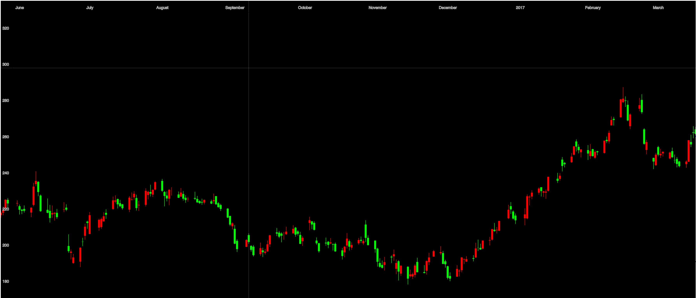

# Elm Price Chart

This is an implementation of a price chart in Elm. You provide `PriceChart` with
information about the price actions you want to display, and it renders an SVG
element. You then embed this SVG element somewhere in an SVG that you create.

Right now `PriceChart` is fairly minimal and unpolished. Ideas, feedback, and
contributions would be greatly appreciated!



## Installation

You can install `PriceChart` using `elm-package`:
```
elm-package install --yes sixty-north/elm-price-chart
```

## Usage

`PriceChart` is a bit of a "component" in the sense that it has its own
messages, update function, model, and subscriptions. To use it you need to do a
few things:

1. Include a `PriceChart.Model` in your model.
2. Provide an "out message" type wraps `PriceChart.Msg`.
3. When your update sees this "out message", you must call `PriceChart.update`
   with the wrapped message and your `PriceChart` model.
4. Subscribe to `PriceChart.subscriptions`.
5. Tell `PriceChart` the extents of the DOM element in which it is rendering.
   (This can be tricky, but it is needed so that `PriceChart` can properly
   interpret mouse events.)

### Create an "out message" wrapper

In your messages, create one that wraps `PriceChart.Msg`:

```elm
import PriceChart

type Msg
    = MyMsg
    | SomeOtherMsg Int
    | PriceChartOutMsg PriceChart.Msg
```

### Adding `PriceChart.Model` to your model

Your model will need to store a `PriceChart.Model` somewhere:

```elm
import PriceChart

type alias Model =
    { myData : Int
    . . .
    , priceChart : PriceChart.Model Msg.Msg
    }
```

Note that `PriceChart.Model` is parameterized on your message type.

You can get an initial `PriceChart.Model` from `PriceChart.initialModel`:

```elm
import PriceChart

initialModel =
    { myData = 42
    . . .
    priceChart = PriceChart.initialModel PriceChartOutMsg
    }
```

### Pass `PriceChart` messages to `PriceChart.update`

When your `update` receives your wrapper messages, it should pass the contents
along to `PriceChart.update`. This will return a new `PriceChart.Model` that you
should store in your model:

```elm
import PriceChart

update msg model =
    case msg of
        . . .
        PriceChartOutMsg pcMsg ->
            let
                (mdl, cmd) = PriceChart.update pcMsg model.priceChart
            in
                {model | priceChart = mdl} ! [cmd]
```

### Put some price information into your `PriceChart.Model`

The whole point of the price chart it to render price information, so you'll
likely want to put some in there. This could come from anywhere, but as long as
you can get it into a `PriceChart.Types.PriceHistory` then `PriceChart` can work
with it.

```elm
populatePrices : Model -> PriceChart.Types.PriceHistory -> Model
populatePrices model history =
    let
        pcMdl = model.priceChart
    in
        {model | priceChart = { pcMdl | prices = history }}
```

There are, of course, other things you may want to set on the `PriceChart.Model`.

### Render the price chart in your view

To render the `PriceChart` you need to create an SVG in which it will render.
You also need to determine (possibly through a port...it's not trivial in Elm)
the screen extents --- left, right, top, and bottom coordiates --- of the SVG in
which the price chart will render.

```elm
import PriceChart
import PriceChart.Types

view model =
    let
        -- the screen coordinates of the DOM element "#price-chart"
        screenRect = PriceChart.Types.ElementRect 100 200 300 400
    in
        div []
            [ svg [id "price-chart", viewBox "0 0 100 100"]
                [PriceChart.priceChart model.priceChart screenRect]]
```

### Subscribe to `PriceChart.subscriptions`

In order to get full functionality of the chart, you need to subscribe to
`PriceChart.subscriptions`:

```elm
import PriceChart

main =
    Html.program
        { init = initialModel
        , view = view
        , update = update
        , subscriptions = \m -> PriceChart.subscriptions m.priceChart
        }
```

That should do it!
